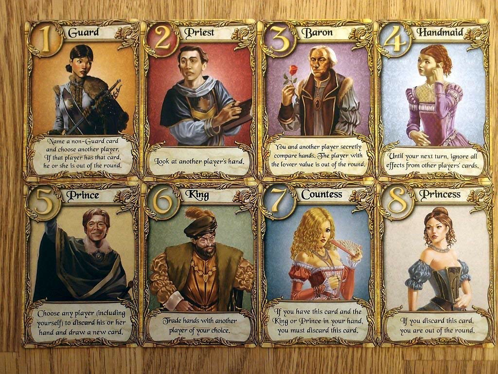

# Trabajo Práctico del Taller de Programación Avanzada

## Introducción
Durante el taller desarrollaremos un juego de cartas multijugador, respetando las reglas del [Love Letter](https://www.boardgamegeek.com/boardgame/129622/love-letter). A lo largo de las clases del taller se les proveerá de herramientas para poder realizarlo en Java, con las buenas prácticas que irán adquiriendo.

### Metodología de trabajo

La realización del juego, tendrá tres etapas con sus respectivas entregas:

| Fecha | Contenido de la entrega                                                                                        |
|-------|----------------------------------------------------------------------------------------------------------------|
| 17/10 | Diagrama de clases del modelo del juego, implementado y testeado (código)                                      |
| 14/11 | Posibilidad de interactuar con los elementos del juego en tiempo real en un entorno simulado, de forma gráfica |
|  5/12 | Capacidad de ser jugado a través de cliente-servidor                                                           |

> Se espera que las prácticas de programación sean buenas, y adecuadas al conocimiento adquirido en la materia.
> Esto incluye evitar el código aglomerado, tener una buena interacción de clases, no duplicar funcionalidades, tener el código indentado y prolijo, entre otras.

---

## Mecánica del juego

El objetivo de cada jugador, es entregar una carta de amor a la princesa con ayuda de sus colaboradores
* El juego utiliza un mazo de cartas especificado en su propia sección
* Una partida debe contar como mínimo con 2 jugadores (y soportar hasta 4)
* Una partida debe contar con múltiples rondas, que finalizará cuando no haya más cartas en el mazo, o cuando quede un solo jugador en juego
* Una partida finaliza cuando un jugador haya conseguido alcanzar una cantidad de símbolos de afecto establecidas al principio de la partida (a elegir entre 2 a {una_cantidad_razonable})

* Al inicio de la ronda, se elimina del juego una carta al azar (su valor será secreto), y se reparte una carta a cada jugador. El resto de las cartas pertenece al mazo

* Durante el turno de cada jugador, este roba una carta del mazo a su mano, y luego juega/descarta una de las cartas de su mano
* Al jugarse/descartarse una carta, activa su efecto (explicadas en la sección del mazo de cartas). Una vez activado termina el turno de ese jugador, y comienza el del siguiente
* Cuando se llegue a la condición de fin de ronda, el jugador que tiene en su mano la carta con valor numérico más alto (fuerza), gana la ronda (Si hay empate, gana el jugador que haya jugado/descartado más cartas en la ronda)
* El jugador que gana una ronda, gana un símbolo de afecto

## Mazo de cartas

| Nombre    | Fuerza | Cantidad en el mazo | Efecto al jugarse/descartarse                                                                                                                                                                       |
|-----------|--------|---------------------|-----------------------------------------------------------------------------------------------------------------------------------------------------------------------------------------------------|
| Guardia   | 1      | 5                   | El jugador elige otro jugador oponente y nombra un tipo de carta (excepto "Guardia"). Si el oponente tiene en su mano una carta de ese tipo, el oponente es eliminado de la ronda                   |
| Sacerdote | 2      | 2                   | El jugador elige otro jugador para ver la cartas en su mano                                                                                                                                         |
| Barón     | 3      | 2                   | El jugador elige otro jugador y se revelan las cartas de forma privada. El jugador que posee la carta con menos fuerza es eliminado de la ronda                                                     |
| Mucama    | 4      | 2                   | El jugador está protegido y no puede ser afectado por cartas de otros jugadores hasta su siguiente turno                                                                                            |
| Príncipe  | 5      | 2                   | El jugador elige otro jugador (incluso a sí mismo) para descartar su mano y robar una carta nueva. Si la Princesa es descartada de esta manera, el jugador que la descartó es eliminado de la ronda |
| Rey       | 6      | 1                   | El jugador elige otro jugador e intercambian sus manos                                                                                                                                              |
| Condesa   | 7      | 1                   | Si un jugador tiene esta carta y el Rey o el Príncipe, esta carta debe ser jugada inmediatamente                                                                                                    |
| Princesa  | 8      | 1                   | Si un jugador juega o descarta esta carta por cualquier motivo, ese jugador es eliminado de la ronda                                                                                                |

## Variaciones

Existen [variaciones del juego](https://en.wikipedia.org/wiki/Love_Letter_(card_game)#Variations), que podrían implementar. O hacer la variación propia :)

## Requisitos

1. Como usuario quiero ingresar al juego eligiendo un nombre, para poder jugar contra otros jugadores en una sala
2. Como usuario quiero seleccionar una sala de las existentes, para poder ingresar y jugar con los participantes (*1)
3. Como usuario quiero crear nuevas salas para que ingresen otros jugadores (*2)
4. Como usuario quiero poder cambiar la configuración de la partida (cantidad de símbolos de afecto para ganar, que jugador comienza la ronda, y cual es el orden de la ronda) desde la sala, antes de iniciar la partida
5. Como usuario quiero poder salir de una sala, incluso si en la misma el juego se encuentra en ejecución (rendirse) (si solo un jugador queda en la sala, este gana la partida)
6. Como usuario quiero poder identificar cada jugador (saber quién lo maneja, y ver su puntaje)

### Requisitos opcionales (base de datos)
1. En vez de ingresar con un nombre, se debe ingresar con un nombre de usuario y una clave, o poder crear uno (modificando el punto 1)
2. Como usuario quiero poder elegir un jugador para ver sus estadísticas (cantidad de: victorias, derrotas, partidas jugadas, rondas ganadas, cartas jugadas, etc)

Notas:
> (*1) Una sala puede estar activa para que ingresen jugadores mientras un juego no esté activo en la misma. Aún así, debe aparecer en la lista de juegos como que el juego ya inició

> (*2) La partida podrá ser iniciada por el creador de la sala, o cuando todos los jugadores estén listos, o cualquier otra condición que consideren

